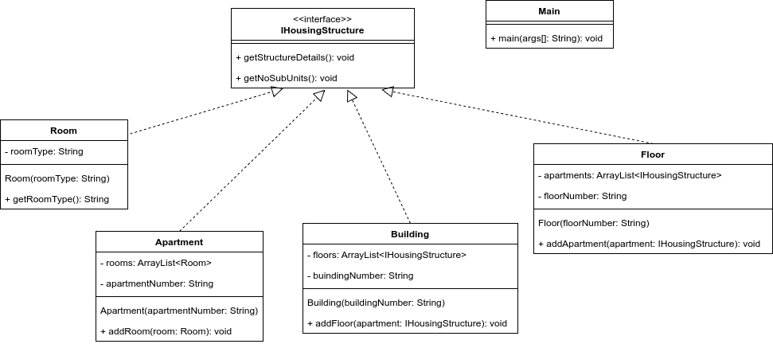

# Lab Assignment 4: Write a Java program to demonstrate the implementation of a composite design pattern by using an example with a building composed of generic housing structures.

## Class Diagram

## Structure of the Program

1. `IHousingStructure` interface: names all the common methods shared between all the different structures.
1. `Room` class: implements the `IHousingStructure` interface with functionalities for room.
1. `Apartment` class: implements the `IHousingStructure` interface with functionalities for required for apartments.
1. `Floor` class: implements the `IHousingStructure` interface with functionalities essential for describing floor structure.
1. `Building` class: implements the `IHousingStructure` interface with functionalities for describing the buinding structure.
1. `Main` class: contains the `main` method and demonstrates the composite design pattern

## Ouput
The output of the demo program can be found inside <a href="Output.txt">Out.txt</a>